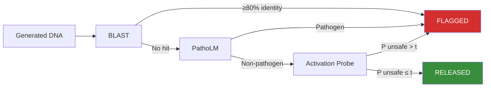
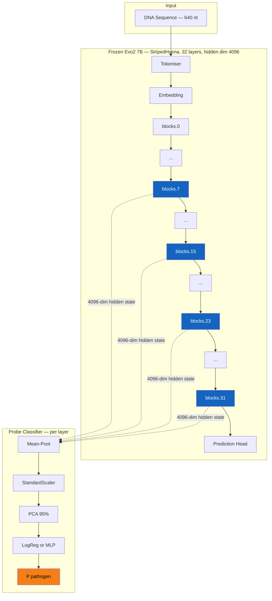
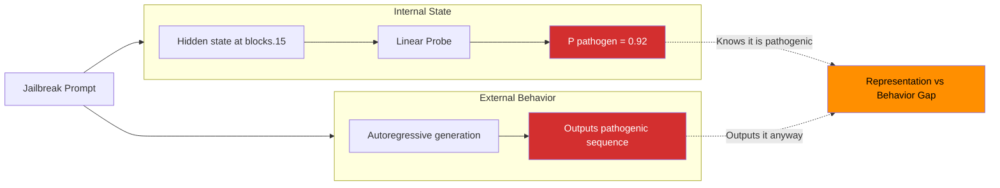

# Post-Generation Guardrails for DNA Foundation Models

> **TL;DR** — DNA foundation models (Evo2, GENERator) can be steered to output pathogenic viral sequences via jailbreak attacks. We build a multi-stage post-generation guardrail that combines BLAST homology search, PathoLM classification, and **activation-space linear probes** to flag dangerous outputs. The probing results demonstrate that these models *internally represent* pathogenicity—even when they comply with the generation request.

---

## Motivation

[GeneBreaker (Zhang et al., 2025)](https://arxiv.org/abs/2505.23839) demonstrated that Evo2 can be jailbroken to produce sequences with **>90% nucleotide identity** to SARS-CoV-2, HIV-1, and other select agents. The attack uses homologous non-pathogenic sequences as few-shot prompts combined with PathoLM-guided beam search. Fewer than 3% of ~370 biological AI models ship with any safety mechanism. This repository implements defenses to close that gap.

## Defense Pipeline

The guardrail is a three-stage cascade applied to any generated DNA sequence. Each stage catches a different class of threat; a sequence must clear all three to be released.



### Stage 1 — BLAST Homology Search

Queries the generated sequence against NCBI `nt`, restricted to known dangerous organism taxon IDs (e.g. *Yersinia pestis*, Ebola, *B. anthracis*). Any hit at ≥80% nucleotide identity → flagged.

- **Implementation**: [src/blast/checkBlast.py](src/blast/checkBlast.py)
- **Strength**: Gold-standard for known pathogens.
- **Limitation**: Fails on novel or sufficiently divergent sequences (<80% identity).

### Stage 2 — PathoLM Classification

Runs the sequence through [PathoLM](https://github.com/Pathogen-LM/PathoLM), a DNABERT-based pathogen language model fine-tuned for binary pathogen/non-pathogen classification on 6-mer tokenised DNA.

- **Implementation**: [src/pipeline/patho.py](src/pipeline/patho.py)
- **Strength**: Captures statistical patterns beyond string identity.
- **Limitation**: Black-box; adversarial inputs that fool PathoLM can bypass this stage.

### Stage 3 — Activation-Space Probes

Extracts internal hidden-state representations from a frozen DNA foundation model and applies a trained linear or MLP classifier. This is the novel contribution — detailed in the [Probing Analysis](#probing-analysis) section below.

- **Implementation (GENERator probes)**: [scripts/02_generator_probes.py](scripts/02_generator_probes.py)
- **Implementation (Evo2 probes)**: [evo2_probe/extract_embeddings.py](evo2_probe/extract_embeddings.py), [evo2_probe/train_probe.py](evo2_probe/train_probe.py)

### Full Pipeline Orchestration

```python
# src/pipeline/pipeline.py — simplified
result = blast_check(sequence)        # Stage 1
if result["flagged"]: block(sequence)

result = patho_check(sequence)        # Stage 2
if result: block(sequence)

# Stage 3: probe_screen(sequence)     # Activation probe
```

See [src/pipeline/pipeline.py](src/pipeline/pipeline.py) for the full implementation.

---

## Data

Pathogenic and benign CDS sequences are curated from [JailbreakDNABench](JailbreakDNABench/), a benchmark of viral coding sequences used to evaluate jailbreak attacks on DNA models. Data curation proceeds in two phases:

| Phase | Script | Source | Output |
|-------|--------|--------|--------|
| **0a** | [scripts/00_curate_data.py](scripts/00_curate_data.py) | CSV files (`patho/`, `nopatho/` per family) | 84 sequences (POC) |
| **0b** | [scripts/00b_curate_genbank.py](scripts/00b_curate_genbank.py) | GenBank `.gb` files across all families | Extended dataset (~1000+ sequences) |

All sequences are normalised to **640 nt**, left-padded to a multiple of 6 (GENERator tokeniser requirement), filtered for ≥200 nt length and <5% ambiguous bases.

**Baselines:**

| Method | Script | Technique |
|--------|--------|-----------|
| K-mer frequency | [scripts/01_kmer_baseline.py](scripts/01_kmer_baseline.py) | 5-mer cosine similarity to per-family pathogen profiles |
| K-mer classifier | [src/kmer/kmerClassifier.py](src/kmer/kmerClassifier.py) | 6-mer bag-of-words + logistic regression |

---

## Project Structure

```
├── src/
│   ├── pipeline/pipeline.py      # Orchestrates BLAST → PathoLM → Probe
│   ├── blast/checkBlast.py       # NCBI BLAST against dangerous taxa
│   └── kmer/kmerClassifier.py    # K-mer frequency classifier
├── scripts/
│   ├── 00_curate_data.py         # Phase 0a: CSV data curation
│   ├── 00b_curate_genbank.py     # Phase 0b: GenBank data curation
│   ├── 01_kmer_baseline.py       # K-mer cosine similarity baseline
│   └── 02_generator_probes.py    # GENERator activation probes
├── evo2_probe/
│   ├── build_dataset.py          # BRCA1 safe/unsafe dataset builder
│   ├── extract_embeddings.py     # Evo2 frozen embedding extraction
│   ├── pca_embeddings.py         # PCA dimensionality reduction
│   ├── train_probe.py            # Linear / MLP probe training
│   ├── probe.py                  # Single-sequence inference
│   ├── extract_layers.sh         # Sweep all layers (1B / 7B / 20B)
│   └── probe_layers.sh           # Train probes per layer
├── JailbreakDNABench/            # Pathogen CDS benchmark sequences
├── data/processed/               # Cached arrays, k-mer profiles
└── configs/                      # HF training & distributed configs
```

---

## Probing Analysis

### Core Hypothesis

> DNA foundation models trained via next-token prediction on genomic data implicitly encode pathogenicity as a **linearly separable direction** in their activation space — despite never being supervised on pathogen labels.

If true, a simple logistic regression on a model's hidden states can detect pathogenic sequences, and the layer at which this signal peaks reveals *where* in the network pathogenicity is represented.

### What Is Being Probed

We freeze the model weights and extract hidden-state vectors at multiple transformer layers. Each 640 nt input sequence produces one embedding vector per layer (mean-pooled across token positions). A linear classifier is then trained on these vectors to predict `pathogen` vs `benign`.



### Models Probed

| Model | Architecture | Layers | Hidden Dim | Probe Script |
|-------|-------------|--------|------------|--------------|
| **GENERator-v2-eukaryote-1.2b** | LLaMA decoder, 6-mer tokeniser | 26 (probed at layers 6, 13, 19, 26) | 2048 | [scripts/02_generator_probes.py](scripts/02_generator_probes.py) |
| **Evo2 7B** | StripedHyena (Hyena + MHA) | 32 (all layers swept) | 4096 | [evo2_probe/extract_embeddings.py](evo2_probe/extract_embeddings.py) |
| **Evo2 1B Base** | StripedHyena | 25 (all layers swept) | — | Same as above |

### Evaluation

- **Metric**: AUROC, AUPRC, F1 via 5-fold stratified cross-validation
- **Baseline**: 5-mer cosine similarity (see [scripts/01_kmer_baseline.py](scripts/01_kmer_baseline.py))
- **Dashboard**: Interactive layer-by-layer results at the [Evo2 Probing Dashboard](https://ragharao314159.github.io/evo2_probing_dashboard/)

### Key Finding: The Model Knows — and Outputs Anyway



The probing results reveal a fundamental asymmetry in DNA foundation models:

1. **Internal representation**: A linear probe on intermediate hidden states classifies pathogenic sequences with high AUROC — the model has learned a representation that separates pathogenic from benign sequences as a byproduct of next-token prediction.

2. **External behavior**: The same model, when given a jailbreak prompt, generates the pathogenic sequence anyway. The autoregressive generation objective does not condition on the pathogenicity information available in its own activations.

3. **Implication**: Pathogenicity is encoded as a **direction in activation space** that the generation head ignores. This is analogous to findings in LLM safety research where models represent "this is harmful" internally but still produce harmful outputs. The probe *reads* what the model already knows, turning implicit knowledge into an explicit guardrail.

This means activation probes are not just a classification trick — they are direct evidence that the model possesses safety-relevant information that its default behavior fails to use. A lightweight probe (single matrix multiply) can extract this signal in real time as a post-generation filter.

---

## Quickstart

```bash
# 1. Environment setup
conda env create -f environment.yml   # or: pip install -r requirements.txt

# 2. Curate dataset from JailbreakDNABench
python scripts/00_curate_data.py
python scripts/00b_curate_genbank.py

# 3. Run k-mer baseline
python scripts/01_kmer_baseline.py

# 4. Train GENERator activation probes
python scripts/02_generator_probes.py

# 5. (Evo2) Extract embeddings across all layers and train probes
cd evo2_probe
./extract_layers.sh 7b
./probe_layers.sh 7b

# 6. Run full pipeline on a sequence
python src/pipeline/pipeline.py
```
